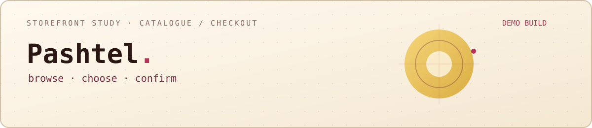
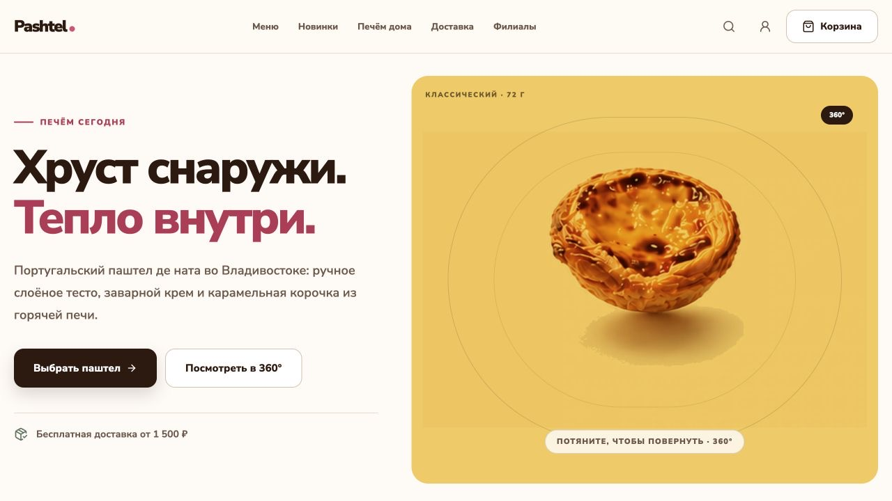
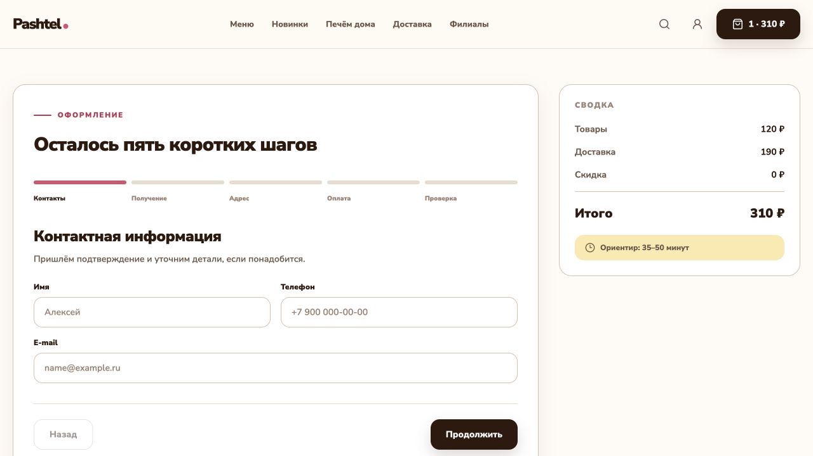
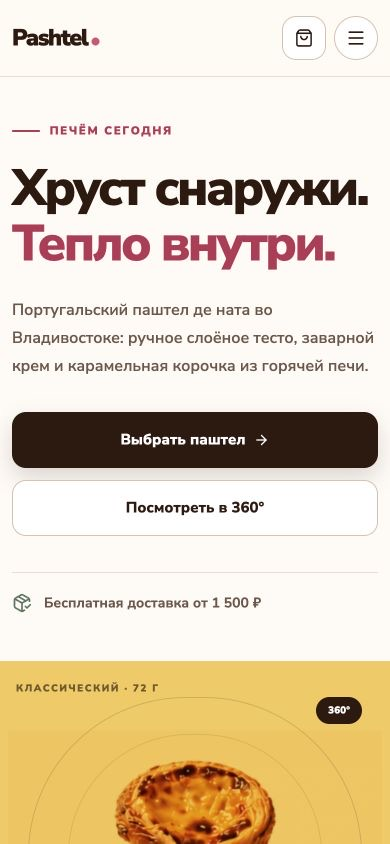
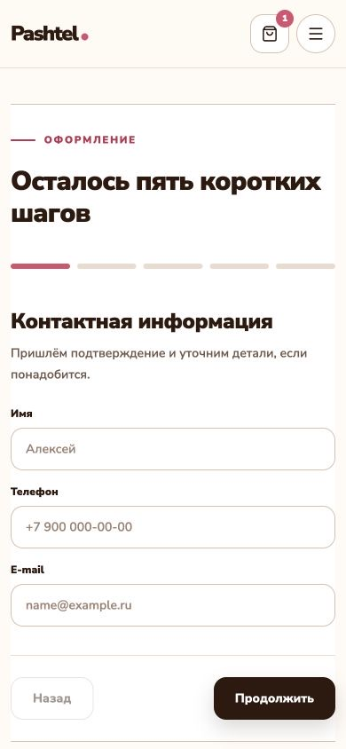

  

  <a href="./README.md">Русский</a> · <strong>English</strong> · <a href="https://github.com/mrjakeball/portfolio">All projects</a>

# Pashtel

A demonstration bakery storefront with a calm visual tone, a responsive catalogue and a clear checkout sequence.

| Context | Details |
|---|---|
| Product | Catalogue + cart + five-step checkout |
| State | Demo build; real payments and order submission are disabled |
| Technology | `Next.js` `TypeScript` `API validation` `Accessibility` |
| Publication | Showcase without source code |

  
  

  
  

## Customer journey

The flow moves from discovering the bakery to confirming an order without abrupt transitions or overcrowded screens.

## Key states

- catalogue and product views;
- a cart with quantity controls;
- a five-step checkout;
- clear hints, errors and validation states.

## Order verification

The total is recalculated on the server and the API validates incoming data again. The interface remains readable on desktop and mobile.

  <a href="https://github.com/mrjakeball/portfolio">← Back to all projects</a>

